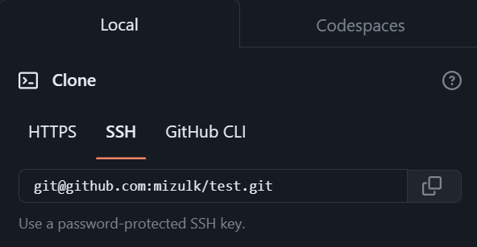

# 测试git团队协作的一个远程仓库

## 视频教程
[尚硅谷Git入门到精通全套教程（涵盖GitHub\Gitee码云\GitLab）-哔哩哔哩](https://www.bilibili.com/video/BV1vy4y1s7k6)

**GitLab可以不用看**

## 克隆到本地命令
在使用该测试仓库时，请将该仓库克隆到本地进行更改  
新建一个文件夹，进入该文件夹，右键>显示更多选项>Git bash here  
输入克隆命令：

```
git clone https://github.com/mizulk/test.git
```
克隆成功后在进行相应的git命令练习或者来测试

## git命令基础

### 配置Git用户名和邮箱
`git config --global user.name <your name>`配置用户名  
`git config --global user.email <your email>`配置邮箱  
以上配置可以在C:\Users\用户名\.gitconfig中查看或修改  
也可以使用`git config --list`来查看配置信息(-l 是--list的别名)

### `git init`
初始化git本地仓库  
该操作回在当前目录下创建.git文件夹  
该文件夹是隐藏的，需要在window资源管理器中的查看>显示>显示隐藏的项目

### `git add <file>`
将文件添加到暂存区中（可删除）（不生成版本号）  
用`git restore --staged <file>`命令来删除撤销更改

### `git commit -m "message"`
提交所有暂存区中的文件（生成版本号）

### `git status`
查看本地库状态

### `git log`
查看修改日志（很详细）

### `git reflog`
查看精简版的修改日志

### `git reset --hard <head>`
切换至指定版本号（需要完整的）的版本  
每次commit都回生成指定的版本号

### `git branch`
显示本地库中所有分支

### `git branch <name>`
创建指定名称的分支，从当前分支上分出

### `git branch -d <branch>`
删除指定名称的分支

### `git checkout <branch>`
切换到指定分支

### `git merge <branch>`
将指定分支合并到当前分支  
当同一行被修改时，需要人工进行合并。  
会出现如下情况：

```
<<<< branch1
……内容1……
====
……内容2……
>>>> branch2
```
将其中一个内容保存下来（删去所有的大于小于等于号，仅留下你需要的内容即可）  
然后输入命令`git add <file>`和`git commit -m "commit message"`来完成合并  
你也可以用`git add .`来将所有文件添加到暂存区

### `git remote -v`
显示远程仓库别名

### `git remote add <name> <url>`
为远程仓库其别名

### `git push <remote> <branch>`
将指定的分支提交到远程仓库

###  `git pull <remote> <branch>`
拉取远程仓库的指定分支的代码。  
用于更新本地仓库，同步团队中其他人做出的修改

### `git clone <url> <branch>`
克隆指定url的仓库的指定分支

## 可能遇到的问题
```
$ git push test master
fatal: unable to access 'https://github.com/mizulk/test.git/': SSL certificate problem: unable to get local issuer certificate
```
**如果遇到该问题的话请用下面的命令来解决**
`git config --global http.sslVerify false`

## Git常用命令图


## git tag 命令

1. `git tag --list` 列出所有的标签
2. `git tag <tag_name>` 创建一个标签
3. `git tag -a <tag_name> -m "<tag_description>"` 创建一个带有注释的标签
4. `git show <tag_name>` 查看标签信息
5. `git ls-remote --tags <remote_name>` 查看所有的远程标签及commit ID
6. `git tag -d <tag_name>` 删除一个标签
7. `git push --delete <remote_name> <tag_name> `删除远程仓库的标签
8. `git push <remote_name> <tag_name>` 推送一个标签到远程
9. `git push <remote_name> --tags` 推送多个本地标签到远程

## git branch 命令

1. `git branch -m <old_branch> <new_branch>` 修改指定分支的名称
2. `git branch -m <new_branch>` 修改当前的分支的名称
3. `git branch <new_branch>` 创建新分支
4. `git branch -d <branch>` 删除本地分支
5. `git branch -D <branch>`或`git branch --delete --force <branch>` 强！制！删！除！本地分支
6. `git push <remote> -d <remote_branch>` 删除远程分支
7. `git branch -a`或`git branch --all` 查看所有分支，包括远程
8. `git branch` 查看本地分支
9. `git branch -r`或`git branch --remotes` 查看远程分支


## git回退版本
### 三种恢复等级
`--soft`仅指针头  
`--mixed`指针头和暂存区  
`--hard`全部

### 版本回退
`git reset --hard HEAD^`返回上一个版本  
`git reset --hard HEAD^^`返回上上一个版本  
`git reset --hard HEAD~3`返回上三个版本  
`git reset --hard HEAD~10`返回上十个版本  
`git reset --hard <commit>`返回指定版本  
版本号可以通过`git reflog`或`git log`来查看  
最后用`git push -f`来强制更新远程仓库

## git删除以跟踪的文件
`git rm --cached <文件名>`
`git rm --cached -r <目录>`
删完后在commit即可

## git 修改历史提交消息

### 修改最近的提交消息

`git commit --amend -m "<commit_msg>"`

### 修改历史消息

`git rebase -i HEAD~2` 其中~2表示修改最近两次提交，`git rebas -i HEAD~n` 修改最近n次提交。
输入命令后将会进入如下界面，最新的提交在最下面（使用vim编辑器）：

```git-rebase-todo
pick d80be02 在README.md中添加有关于git tag的命令
pick 1be2a1f README.md: 添加有关于git branch的命令和调整文案

# Rebase eb2f65a..1be2a1f onto eb2f65a (2 commands)
#
# Commands:
# p, pick <commit> = use commit
# r, reword <commit> = use commit, but edit the commit message
# e, edit <commit> = use commit, but stop for amending
# s, squash <commit> = use commit, but meld into previous commit
# f, fixup [-C | -c] <commit> = like "squash" but keep only the previous
#                    commit's log message, unless -C is used, in which case
#                    keep only this commit's message; -c is same as -C but
#                    opens the editor
# x, exec <command> = run command (the rest of the line) using shell
# b, break = stop here (continue rebase later with 'git rebase --continue')
# d, drop <commit> = remove commit
# l, label <label> = label current HEAD with a name
# t, reset <label> = reset HEAD to a label
# m, merge [-C <commit> | -c <commit>] <label> [# <oneline>]
#         create a merge commit using the original merge commit's
#         message (or the oneline, if no original merge commit was
#         specified); use -c <commit> to reword the commit message
# u, update-ref <ref> = track a placeholder for the <ref> to be updated
#                       to this position in the new commits. The <ref> is
#                       updated at the end of the rebase
#
# These lines can be re-ordered; they are executed from top to bottom.
#
# If you remove a line here THAT COMMIT WILL BE LOST.
#
# However, if you remove everything, the rebase will be aborted.
#

```

根据注释内容，修改对应的提交记录。
这里需要修改提交记录，使用「**r, reword**」，按**i**键进入编辑模式。
修改后的入下（省略注释）：

```git-rebase-todo
reword d80be02 README.md: 添加有关于git tag的命令
pick 1be2a1f README.md: 添加有关于git branch的命令和调整文案
```

编辑完成后按**ESC**键进入vim命令模式，输入命令`:wq`保存并退出，紧接着进入如下界面：

```
在README.md中添加有关于git tag的命令

# Please enter the commit message for your changes. Lines starting
# with '#' will be ignored, and an empty message aborts the commit.
#
# Date:      Sun Dec 1 23:34:50 2024 +0800
#
# interactive rebase in progress; onto eb2f65a
# Last command done (1 command done):
#    reword d80be02 README.md: 添加有关于git tag的命令
# Next command to do (1 remaining command):
#    pick 1be2a1f README.md: 添加有关于git branch的命令和调整文案
# You are currently editing a commit while rebasing branch 'master' on 'eb2f65a'.
#
# Changes to be committed:
#	modified:   README.md
#

```

按**i**键进入编辑模式并修改第一行提交信息（省略注释）：

```
README.md: 添加有关于git tag的命令
```

按**ESC**退出编辑模式，并输入`:wq`保存并退出

```
$ git rebase -i HEAD~2
[detached HEAD 78c70db] README.md: 添加有关于git tag的命令
 Date: Sun Dec 1 23:34:50 2024 +0800
 1 file changed, 16 insertions(+)
Successfully rebased and updated refs/heads/master.

```

修改成功后用`git push -u -f ssh master`强制推送


## 使用SSH（免密登录）
### 配置SSH
1. 打开Git Bash输入`ssh-keygen -t rsa -b 4096 -C "your_email@example.com"`其中的字符串可以是你的邮箱
2. 一直回车即可，如果之前已经创建过SSH密钥，这需要在最后一步（overwrite）输入yes
3. `cat ~/.ssh/id_rsa.pub`查看公钥并复制(ctrl + ins 或 右键选择复制)
4. 如果没有使用Git Bash的话，请复制C:\Users\用户名\.ssh\id_rsa.pub中的内容
5. 点击你的GitHub头像再点击setting，左侧**SSH and GPG keys**，点击New SSH Key。title随便写（例如a），内容把复制的粘贴上去
6. `ssh -T git@github.com`测试连接，有警告就输入yes

### 加密算法推荐使用`ED25519`

1. 即将第一步改为`ssh-keygen -t ed25519 -C "your_email@example.com" `即可

### 使用SSH
#### 新克隆的仓库
例如`git clone git@github.com:mizulk/test.git`


#### 已经克隆下来的仓库
1. 添加远程仓库地址`git remote add ssh git@github.com:mizulk/test.git`
2. pull（拉取）使用`git pull ssh master`
3. push（推送）使用`git push ssh master`

## 使用git的工作流程
1. `git pull origin main`来拉取远程仓库的代码，确保本地代码是最新的
2. 写想要更新的逻辑代码
3. `git add .`将代码放到暂存区
4. `git commit -m "对更新内容的简单描述"`只有commit(提交)完才能push(推送)
5. `git push origin main`将本地的代码推送到远程仓库